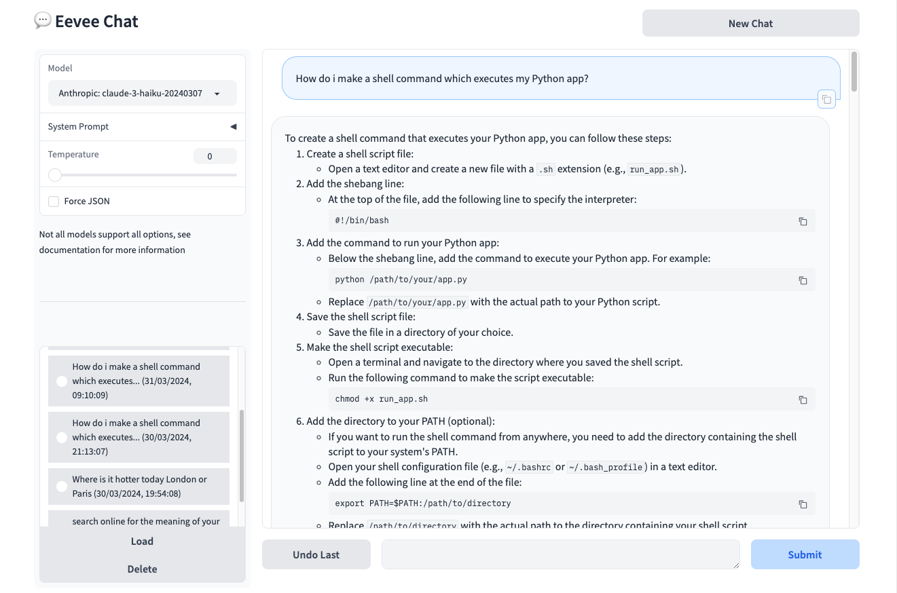

---
is_homepage:
---


# Eevee Chat

[](https://pypi.org/project/eevee-chat/)
[](https://pypi.org/project/eevee-chat/)

Eevee Chat is a unified chat UI for all LLM frameworks. It allows you to use GPT, Claude and many others from the same window, and switch between them even in the middle of a conversation.

Using Eevee is simple and intuitive. LLMs are connected to the web (supporting LLMs only) with either Google Search or DuckDuckGo, and so it suppose to mimic working with the official web apps.

Eevee can also be configured to support custom frameworks and tools easily. See the docs for more information.



## Installation
Install Eevee Chat from PyPi:
```bash
pip install eevee-chat
```

## Running
Once installed (and after frameworks were setup), simply run:
```bash
eevee
```
Eevee Chat will automatically launch on `127.0.0.1:4242` by default.
